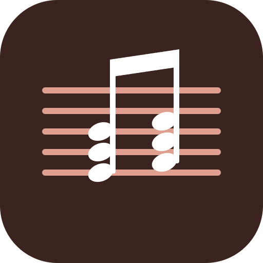
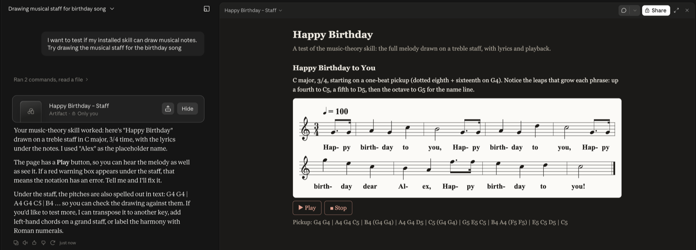
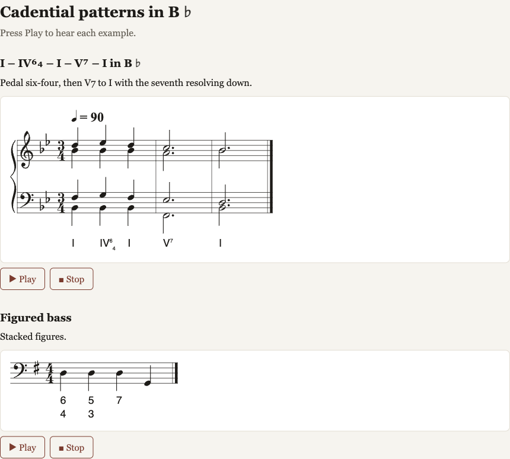
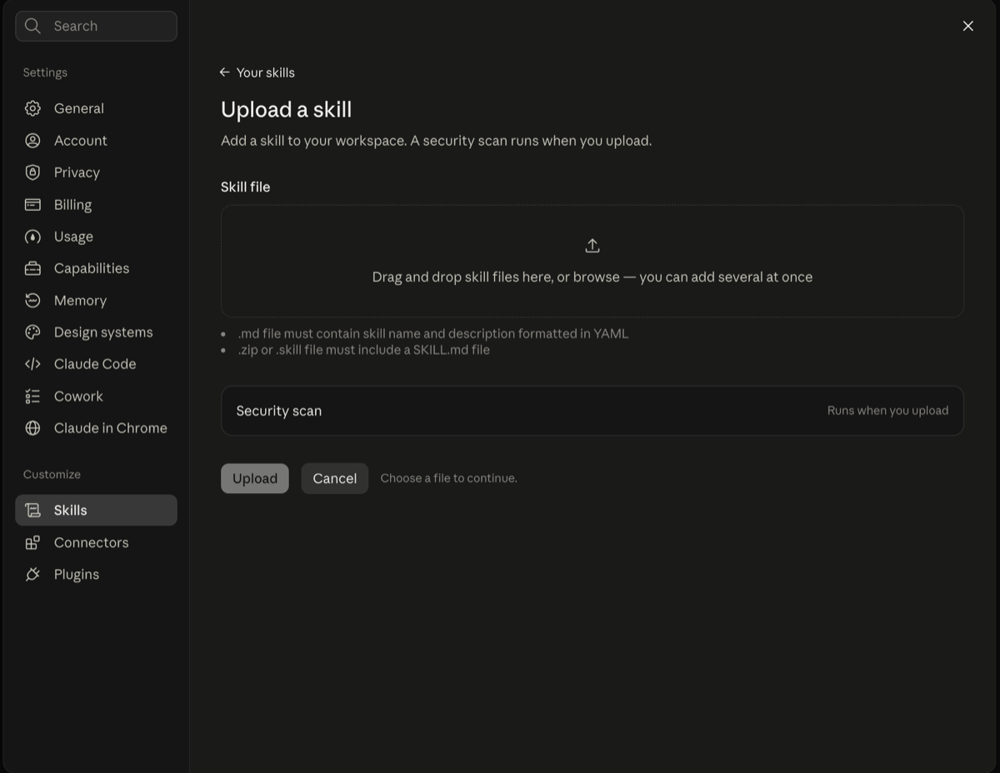
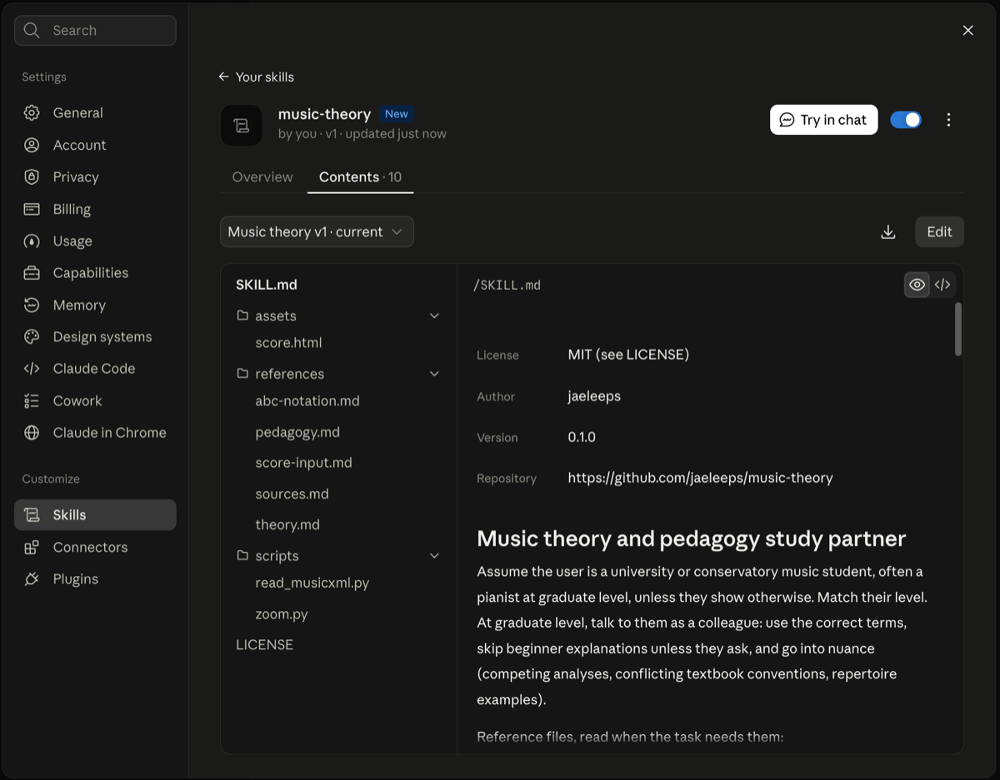

# music-theory

[](https://github.com/jaeleeps/music-theory/releases/latest)
[](LICENSE)
[](https://agentskills.io)



An [Agent Skill](https://agentskills.io) that works as a study partner for **music theory, analysis, and piano pedagogy** at university and conservatory level, and **draws musical examples on real staves** that you can play back.

- **Theory and analysis**: harmony, Roman numerals and figured bass, voice leading, counterpoint, form. It checks part-writing against a full checklist and reports each problem by bar, beat, and voice.
- **Staff notation**: examples are written in [ABC notation](https://abcnotation.com) and drawn with [abcjs](https://github.com/paulrosen/abcjs): grand staff, SATB on two staves, Roman numerals, figured bass, fingering, dynamics, and a Play button.
- **Practice**: quizzes one question at a time, ear training with hidden answers, and returning to the topics you missed.
- **Reading your scores**: MusicXML files (`.musicxml`, `.mxl`) are read exactly, with a standard-library script. PDFs and photos are cut into enlarged crops, read visually, and transcribed for you to confirm. See [the score-reading test](docs/score-reading-test.md) for how accurate that is.
- **Pedagogy**: method comparisons, learning theory, lesson plans, practice strategies, repertoire levels, and help with graduate written work. It never invents citations.

## See it in action

Ask for an example, and Claude draws it on a staff in a side panel that you can play back:



Harmony examples use the same panel. Here, a four-part chorale with Roman numerals and figured bass:



## Install

**claude.ai (web, desktop, mobile)**: no terminal needed.
1. Turn on **Code execution and file creation** in [Settings → Capabilities](https://claude.ai/settings/capabilities).
2. Download `music-theory.zip` from the [latest release](https://github.com/jaeleeps/music-theory/releases/latest).
3. In [Customize → Skills](https://claude.ai/customize/skills), click **+** → **+ Create skill** → **Upload a skill**, choose the zip, and turn the skill on.





See the [claude.ai guide](docs/claude-ai.md) for Team and Enterprise plans, example prompts, building the zip yourself, updating to a new version, and troubleshooting.

**Any agent (Claude Code, Codex, Gemini CLI, Cursor, GitHub Copilot, OpenCode, …)**, using the [`skills`](https://github.com/vercel-labs/skills) installer:

```bash
npx skills add jaeleeps/music-theory
npx skills add jaeleeps/music-theory -g     # every project (user scope)
```

**Claude Code plugin:**

```
/plugin marketplace add jaeleeps/music-theory
/plugin install music-theory@music-theory
```

## Usage

Ask in plain language, for example:
- *"Explain the Neapolitan sixth and show me how it resolves in C minor."*
- *"Check my part-writing:"* followed by your chorale in text or a photo of it.
- *"Quiz me on seventh-chord inversions, one at a time."*
- *"Compare the reading approaches of Faber Piano Adventures and The Music Tree."*

In claude.ai, examples appear as an artifact with the staves and a Play button. A red warning box under a staff means the notation has an error, so tell Claude and it will fix it.

## What it runs and accesses

- **Instructions and references**: Markdown files that Claude reads (`SKILL.md`, `references/`).
- **Score pages**: when Claude draws an example, it builds an HTML artifact from `assets/score.html`. In your browser, that page loads the open-source abcjs library from `cdnjs.cloudflare.com` to draw the notation, and plays sound with your browser's built-in Web Audio. It sends nothing you type anywhere.
- **Two helper scripts**, which Claude runs only on a file you give it, in its code-execution sandbox:
  - `scripts/read_musicxml.py` reads a MusicXML file and prints its notes as text. It uses only Python's standard library.
  - `scripts/zoom.py` saves enlarged crops of a score image, using Pillow.

  Neither script makes network requests or changes any file except the crops it writes.
- **No hooks, MCP servers, telemetry, or data collection.** See [PRIVACY.md](PRIVACY.md).

The `evals/` test suite isn't part of normal use. It runs only when a maintainer starts it by hand.

## Layout

- `skills/music-theory/`: the skill. Installers copy only this folder.
  - `SKILL.md`: the workflow for teaching, checking, quizzing, and drawing staves.
  - `references/abc-notation.md`: ABC syntax as abcjs renders it, the octave rules, grand staff and SATB layout, and a pre-render checklist.
  - `references/theory.md`: labeling conventions, part-writing and counterpoint checklists, and the analysis procedure.
  - `references/pedagogy.md`: piano pedagogy methods, learning theory, lesson planning, practice, and leveling.
  - `references/sources.md`: vetted real references (open textbooks, notation guides, pedagogy, scores), so the skill never invents citations.
  - `assets/score.html`: the page template that draws and plays the examples.
  - `scripts/read_musicxml.py`: prints the notes of a MusicXML score as text (standard library only).
  - `scripts/zoom.py`: cuts a score photo or page into enlarged crops for reading (Pillow).
  - `references/score-input.md`: how to read scores the student sends (MusicXML, PDF, photo), including the transcription procedure.
- `.claude-plugin/`: the Claude Code plugin and marketplace manifests.
- `docs/score-reading-test.md` and `evals/score-reading/`: the blind test of reading notation from images, with its scripts, images, answer key, and results.
- `docs/claude-ai.md`: a step-by-step guide to using the skill in claude.ai.
- `.github/workflows/release.yml`: builds `music-theory.zip` and attaches it to each GitHub release.
- `assets/`: the icon (PNG for listings, SVG source) and the README example image.
- `docs/images/`: claude.ai screenshots used in the README and the guide.
- `PRIVACY.md`: privacy policy.

## Renderer

The notation format (ABC) and the renderer (abcjs, loaded in `assets/score.html`) are kept separate, so the renderer can be replaced without rewriting the skill. abcjs 6.7.1 cannot draw a few symbols: pedal marks, ottava lines, *fp*, inverted turns, two-note tremolos, simile signs, and dotted barlines. Some of these fail without any warning. `references/abc-notation.md` lists each one and the text workaround the skill uses instead.

## License

[MIT](LICENSE)
